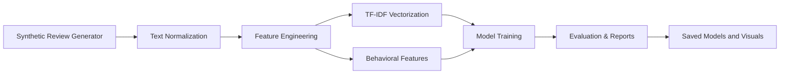
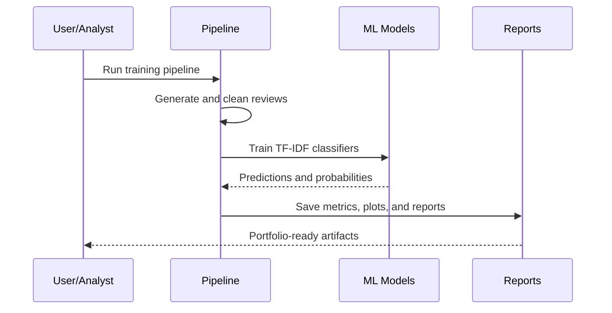

# TruthLens AI


TruthLens AI is an end-to-end NLP and machine learning project that detects fake reviews, manipulative promotional language, spam-like opinion patterns, and suspiciously overhyped customer feedback.

The latest evaluation run lands in a realistic production-style range with 96.24% accuracy and 96.24% weighted F1 after introducing noisy, mixed, and ambiguous review cases.

## Project Overview

This repository demonstrates a complete review-authenticity detection pipeline:

- synthetic review dataset generation
- NLP preprocessing and normalization
- behavioral feature engineering
- TF-IDF vectorization
- model benchmarking across three classifiers
- visual analytics and reporting
- model serialization and reproducible outputs
- confidence analysis and misclassification review

## Architecture



## Workflow



## Problem Statement

Online review platforms are vulnerable to coordinated manipulation, promotional spam, and low-quality synthetic commentary. The goal of this project is to classify reviews as real or fake using both textual and behavioral signals.

## Features

- Generates approximately 4,000 realistic review records
- Applies lowercase conversion, punctuation cleanup, stopword removal, and stemming
- Engineers review length, sentiment, uppercase intensity, and suspicious wording signals
- Trains Logistic Regression, Multinomial Naive Bayes, and Random Forest models
- Compares accuracy, precision, recall, and weighted F1-score
- Saves plots, metrics, reports, and trained artifacts

## Folder Structure

```text
TruthLens-AI/
├── data/
├── metrics/
├── models/
├── notebooks/
├── reports/
├── src/
└── visuals/
```

## Dataset Description

The generated dataset contains these columns:

- `review_text`
- `rating`
- `verified_purchase`
- `review_length`
- `sentiment_score`
- `sentiment_intensity`
- `sentiment_positive`
- `sentiment_negative`
- `sentiment_neutral`
- `suspicious_word_count`
- `uppercase_word_count`
- `exclamation_count`
- `fake_review`

## NLP Pipeline

1. Lowercase transformation
2. Punctuation removal
3. Stopword removal
4. Whitespace cleanup
5. Token normalization with stemming
6. TF-IDF vectorization using tuned feature limits and up to tri-grams

## Model Training

Three classifiers are trained and compared on the same TF-IDF feature space:

- Logistic Regression
- Multinomial Naive Bayes
- Random Forest Classifier

The best model is selected automatically and saved to `models/fake_review_detector.pkl`.

## Results

Outputs are written to:

- `metrics/classification_report.txt`
- `reports/model_metrics.json`
- `reports/project_report.md`
- `visuals/`

Best observed model performance in the latest run:

- Accuracy: 96.24%
- Weighted F1: 96.24%
- Best model: Logistic Regression

## Visualizations

Generated charts include:

- review distribution
- fake vs real pie chart
- word clouds for real and fake reviews
- sentiment distribution
- review length analysis
- correlation heatmap
- confusion matrix
- feature importance plot

## Installation

```bash
pip install -r requirements.txt
```

## Usage

Run the full pipeline:

```bash
python -m src.train_model
```

This will generate the dataset, clean it, train models, create plots, and save all reports and model artifacts.

## Future Improvements

- Add cross-validation and threshold tuning
- Integrate transformer-based models
- Expand the dataset with external review sources
- Build a lightweight inference API

## License

MIT License

## Author Information

Mandeep Kumar

## Notebook

Open `notebooks/truthlens_analysis.ipynb` for the narrative data science walkthrough.
